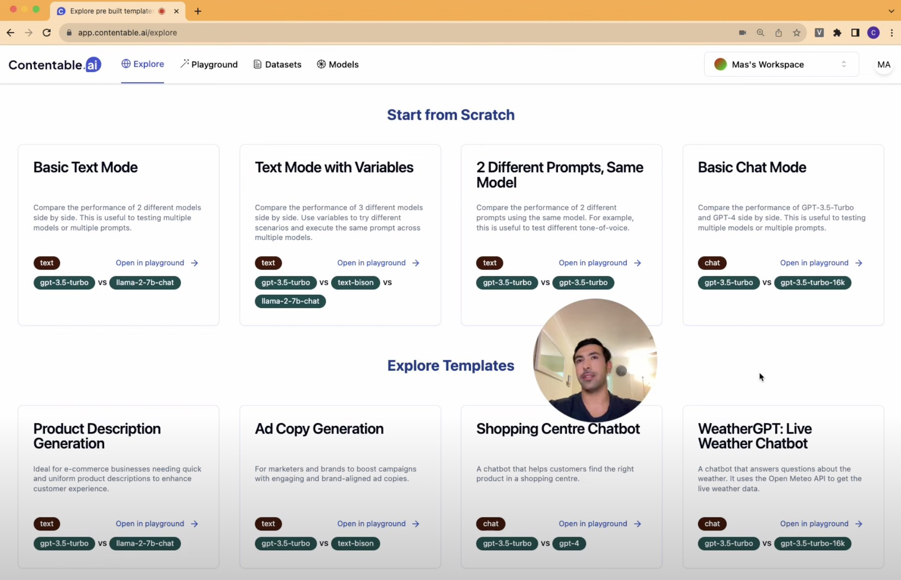

# Free Loom-like Alternative

An intuitive Chrome extension that provides a draggable webcam feed on your browser, similar to Loom, but with a twist. Easily start, stop, and move your video feed around your browser window.
Here's how it looks:

## Features

- **Start and Stop Webcam**: Toggle your webcam feed with a click.
- **Draggable Webcam Feed**: Move the feed anywhere on the browser window.
- **Dynamic Resizing**: Drag the video feed, and it enlarges by 50% for better visibility, reverting to the original size after a brief moment. [TODO]

## Installation

1. Clone or download the repository.
2. Open Chrome and navigate to `chrome://extensions/`.
3. Enable "Developer mode" at the top right.
4. Click "Load unpacked" and select the directory of the extension.
5. The extension is now installed! Look for its icon in the Chrome toolbar.

## Usage

1. Click on the extension's icon in the Chrome toolbar.
2. Choose to start or stop the video feed as needed.
3. Once the video feed is active, drag it around your browser window.

## Contributing

Pull requests are welcome. For major changes, please open an issue first to discuss what you would like to change.

## License

[MIT](https://choosealicense.com/licenses/mit/)
